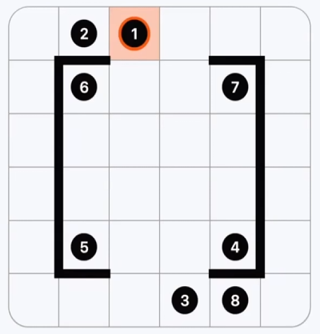

# ZipUnity

A 2D puzzle game in Unity based on the **Zip** puzzle: draw a path through every cell on a grid (starting from the cell marked **1**) so that numbered cells are visited in ascending order. Barriers between cells restrict movement.

---

## Game Objects & Scripts

| GameObject / Asset | Script / Role |
|--------------------|----------------|
| **GridManager** (scene object) | `GridManager.cs` — Builds the playable grid at runtime. Spawns cells from the **CellView** prefab, optionally loads layout from a JSON file (`width`, `height`, `cells`, `blockRight`, `blockUp`), and places **CellBlockRight** / **CellBlockUp** barrier prefabs where needed. Handles grid↔world position and cell lookup. |
| **Cell** (prefab: `CellView.prefab`) | `CellView.cs` — One grid cell. Stores grid coordinates (X, Y), optional display number, and visited state. Shows a number label and badge when the cell has a value; highlights (e.g. light blue) when visited. Expects optional child **Value** (TextMeshPro) and **Badge** (SpriteRenderer). |
| **CellBlockRight** (prefab) | No script. Visual/barrier block on the *right* edge of a cell; blocks horizontal movement across that edge. Instantiated by `GridManager` when loading JSON with `blockRight`. |
| **CellBlockUp** (prefab) | No script. Visual/barrier block on the *top* edge of a cell; blocks vertical movement across that edge. Instantiated by `GridManager` when loading JSON with `blockUp`. |
| **Input/controller** (scene object) | `GameController.cs` → **ZipInputController** — Mouse input and puzzle logic: start path on cell **1**, extend path by dragging to adjacent cells (respecting barriers), rewind by moving back over the previous cell, reset by clicking cell **1** again. Draws the path with a **LineRenderer** (snake line); line color indicates stuck vs valid state. Win condition: all cells visited once and numbered cells visited in strict order 1, 2, 3, … |

Puzzles are defined as JSON files in `Assets/Puzzles/` (e.g. `Zip308.json`). Assign the desired JSON to the GridManager’s **Grid Json File** in the Inspector to load that puzzle.

---

## Puzzle JSON Format

Puzzles are stored as JSON with a fixed structure. Here is **Zip308** as a reference:



**Example: `Assets/Puzzles/Zip308.json`**

```json
{
  "width": 6,
  "height": 6,

  "cells": [
    [0, 2, 1, 0, 0, 0],
    [0, 6, 0, 0, 7, 0],
    [0, 0, 0, 0, 0, 0],
    [0, 0, 0, 0, 0, 0],
    [0, 5, 0, 0, 4, 0],
    [0, 0, 0, 3, 8, 0]
  ],

  "blockRight": [
    [false, false, false, false, false, false],
    [true, false, false, false, true, false],
    [true, false, false, false, true, false],
    [true, false, false, false, true, false],
    [true, false, false, false, true, false],
    [false, false, false, false, false, false]
  ],

  "blockUp": [
    [false, false, false, false, false, false],
    [false, true, false, false, true, false],
    [false, false, false, false, false, false],
    [false, false, false, false, false, false],
    [false, false, false, false, false, false],
    [false, true, false, false, true, false]
  ]
}
```

**How to read and build the JSON**

- **`width`**, **`height`** — Grid size (number of columns and rows).
- **`cells`** — 2D array of cell values. Row index `0` is the **top** row of the puzzle; column index `0` is the left. Each value is the number to show in that cell: `0` = empty, `1` = start cell, `2`, `3`, … = checkpoints in order. The path must start at **1** and visit numbered cells in ascending order.
- **`blockRight`** — 2D array of booleans, same dimensions as the grid. `true` at `[row][col]` means: place a barrier on the **right** edge of the cell at that position (it blocks moving right from that cell and moving left into it from the neighbor).
- **`blockUp`** — Same idea: `true` at `[row][col]` means a barrier on the **top** edge of that cell (blocks moving up from that cell and moving down into it from above).

When creating your own puzzle: (1) set `width` and `height`; (2) fill `cells` so row 0 is the top row and you have exactly one **1** and a contiguous set of numbers (e.g. 1–8); (3) set `blockRight` and `blockUp` to `true` only where you want a wall on that cell’s right or top edge. Save as a `.json` in `Assets/Puzzles/` and assign it to GridManager’s **Grid Json File**.

---

## Running from Source (Unity Editor)

1. **Unity version**  
   The project uses **Unity 6** (6000.0.23f1). Use this or a compatible 6.x version to avoid import/API issues.

2. **Get the project**  
   Clone or download the repo:
   ```bash
   git clone <repository-url>
   cd ZipUnity
   ```

3. **Open in Unity**  
   - Open Unity Hub → **Add** → select the `ZipUnity` folder (the one that contains `Assets` and `ProjectSettings`).  
   - Open the project. Let Unity import and compile (first time may take a minute).

4. **Play**  
   - In **Project**, open `Assets/Scenes/Zip.unity`.  
   - Press **Play**.  
   - Use the mouse: click and drag from the cell marked **1** to draw a path through every cell; numbered cells must be visited in order. Click **1** again to restart the path.

No build is required to play; run the scene in the Editor. To switch puzzles, select the GridManager in the hierarchy and assign a different JSON from `Assets/Puzzles/` to **Grid Json File**.
